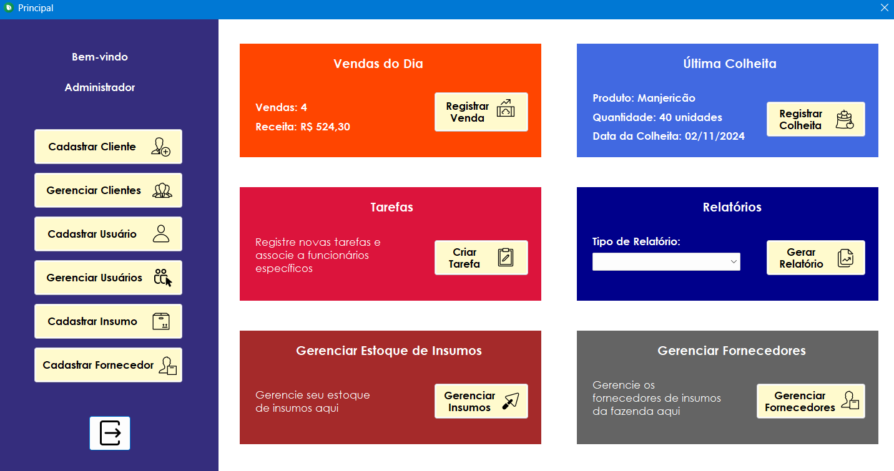
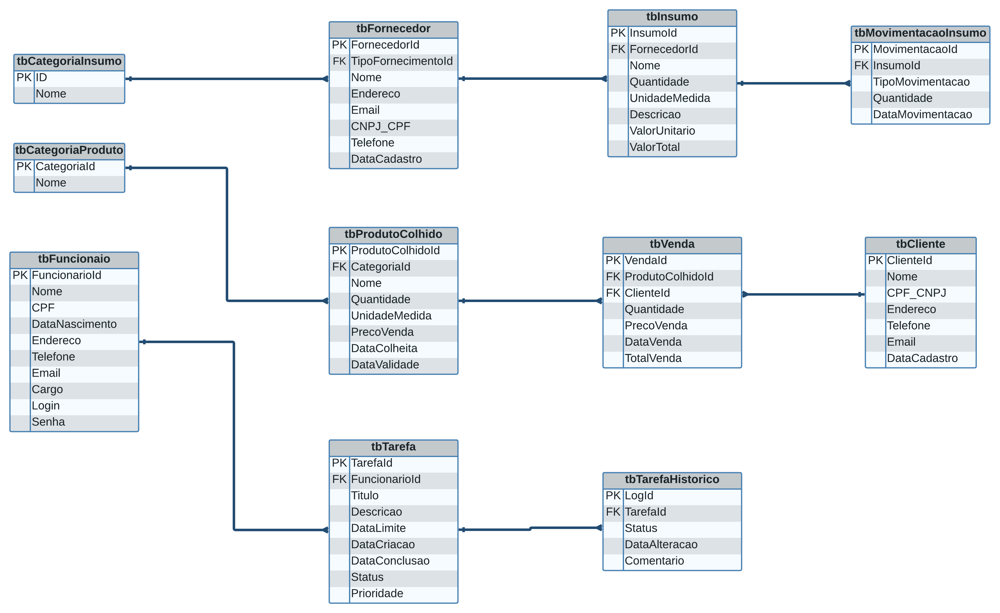

# Sistema Integrado para Controle de Operações em Fazenda Urbana

## Visão geral

Este projeto consiste no desenvolvimento de um sistema integrado para controle de operações em uma fazenda urbana, criado em contexto acadêmico com o objetivo de aplicar conceitos de análise de sistemas, modelagem de dados e integração entre aplicações.

A solução é composta por uma aplicação desktop, um aplicativo mobile e um banco de dados central, permitindo o registro, consulta e gerenciamento das informações do sistema de forma organizada. A comunicação entre as aplicações foi realizada por meio de integração de sistemas, garantindo a consistência dos dados entre as diferentes camadas da solução.

O foco principal do projeto esteve na estruturação do sistema como um todo, priorizando a organização da informação, a definição clara de responsabilidades entre os módulos e a documentação das funcionalidades implementadas.

## Arquitetura da solução

A solução foi projetada com uma arquitetura integrada, composta por três camadas principais: aplicação desktop, aplicação mobile e banco de dados, permitindo a comunicação e o compartilhamento de informações entre os diferentes módulos do sistema.

### 🖥️ Aplicação Desktop

A aplicação desktop é responsável pelas principais operações do sistema, como:

- cadastro e gerenciamento das informações

- consulta e atualização de dados

- integração com o banco de dados

- comunicação com o aplicativo mobile

Ela atua como o núcleo do sistema, concentrando a lógica principal e garantindo que as informações estejam sempre consistentes.

### 📱 Aplicação Mobile

O aplicativo mobile foi desenvolvido para permitir o acesso remoto a funcionalidades específicas do sistema, oferecendo maior flexibilidade no uso da solução.

- consome os dados disponibilizados pela camada de integração

- reflete as informações registradas no sistema central

- mantém alinhamento com os dados persistidos no banco

### 🗄️ Banco de Dados

O banco de dados funciona como o repositório central das informações, sendo estruturado a partir de um modelo de dados previamente definido.

- dados organizados de forma relacional

- foco em integridade e consistência

- suporte às operações realizadas pelas aplicações

### 🔗 Integração entre os Módulos

A integração entre os módulos do sistema foi implementada de forma a permitir a **troca de informações entre a aplicação desktop e o aplicativo mobile**, utilizando uma camada intermediária de comunicação.

Essa abordagem permitiu:
- manter o **banco de dados centralizado**
- evitar acesso direto do aplicativo mobile ao banco
- garantir maior **controle sobre o fluxo de dados**
- facilitar a manutenção e a evolução dos módulos de forma independente

*Tela principal da aplicação desktop, com acesso às principais funcionalidades e visualização de informações operacionais.*

## Papel Desempenhado no Projeto

Neste projeto acadêmico, atuei de forma ativa nas etapas de **análise, concepção, desenvolvimento e documentação** da solução, contribuindo diretamente para a estruturação do sistema como um todo.

Minhas principais responsabilidades incluíram:

- desenvolvimento da **aplicação desktop**, desde a implementação das funcionalidades até a integração com o banco de dados  
- **modelagem de dados**, definição das entidades e relacionamentos utilizados no sistema  
- implementação da **integração entre a aplicação desktop e o aplicativo mobile**, garantindo a consistência das informações  
- levantamento e detalhamento de **requisitos funcionais**  
- elaboração da **documentação técnica** do projeto, descrevendo o funcionamento das aplicações e o fluxo de dados  
- organização e coordenação das atividades do projeto acadêmico, definindo responsabilidades e acompanhando a execução das tarefas

As demais partes do sistema, como o desenvolvimento do aplicativo mobile e da camada de integração, foram realizadas por outros integrantes do grupo, seguindo a arquitetura e as diretrizes definidas no projeto.

## Principais Funcionalidades

O sistema desenvolvido contempla as seguintes funcionalidades principais:

- **Cadastro e gerenciamento de informações** relacionadas às operações da fazenda urbana  
- **Consulta e atualização de dados** por meio da aplicação desktop, com persistência no banco de dados central  
- **Integração entre a aplicação desktop e o aplicativo mobile**, permitindo o compartilhamento e a sincronização das informações  
- **Controle de acesso ao sistema**, com autenticação de usuários e proteção básica de credenciais  
- **Registro e organização dos dados operacionais**, garantindo consistência e integridade das informações  
- **Apoio à tomada de decisão**, por meio da centralização e estruturação dos dados do sistema
- **Validação de dados** durante o cadastro e a atualização das informações, reduzindo inconsistências no banco de dados

## Modelagem de Dados

A modelagem de dados do sistema foi realizada com foco na **organização das informações**, **integridade dos dados** e **clareza dos relacionamentos** entre as entidades envolvidas nas operações da fazenda urbana.

Antes da implementação, foi elaborado um **modelo conceitual**, identificando as principais entidades do sistema e suas relações, que posteriormente foi convertido em um **modelo relacional** para implementação no banco de dados.

Durante a modelagem, foram considerados aspectos como:

- definição clara das **entidades e seus atributos**
- estabelecimento de **relacionamentos** entre as tabelas
- uso de **chaves primárias e estrangeiras** para garantir integridade referencial
- organização dos dados de forma a facilitar consultas e manutenções futuras

Essa abordagem permitiu estruturar o banco de dados de maneira consistente, servindo como base para a integração entre a aplicação desktop e o aplicativo mobile, além de apoiar as funcionalidades implementadas no sistema.

*Diagrama entidade-relacionamento utilizado na modelagem do banco de dados.*

## Tecnologias Utilizadas

As tecnologias utilizadas no desenvolvimento do projeto foram definidas de acordo com o escopo acadêmico da solução e a necessidade de integração entre os módulos do sistema.

### 🖥️ Aplicação Desktop
- **C#**
- **.NET (Windows Forms)**
- **SQL Server** para persistência e gerenciamento dos dados

### 🔗 Integração de Sistemas
- **API REST** para comunicação entre a aplicação desktop e o aplicativo mobile  
- **Spring Boot** utilizado na implementação da camada de integração

### 🗄️ Banco de Dados
- **SQL Server**
- Modelo relacional baseado em entidade-relacionamento

## Observações Finais

Este projeto foi desenvolvido em contexto acadêmico com o objetivo de aplicar, de forma prática, conceitos de **análise de sistemas, modelagem de dados e integração entre aplicações**. O foco esteve na organização da solução como um todo, priorizando a estruturação dos dados, a definição clara das responsabilidades entre os módulos e a documentação do sistema.

Apesar do escopo controlado, o projeto permitiu consolidar conhecimentos técnicos e metodológicos relevantes, servindo como base para o desenvolvimento de soluções integradas em ambientes reais.
